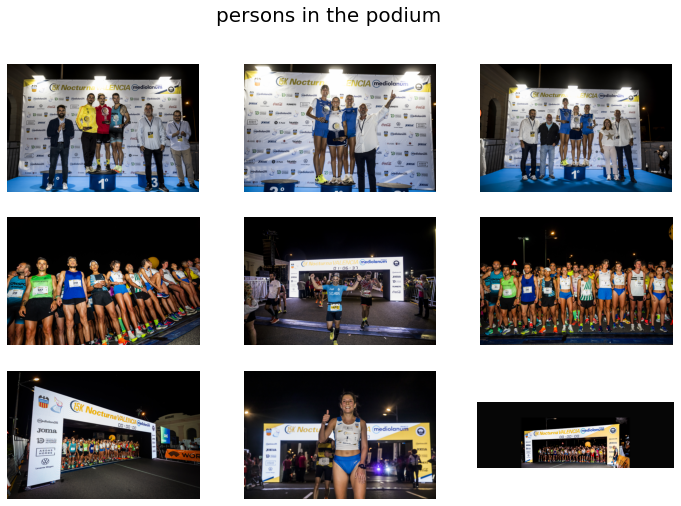

![Made-love][made-love-shield]
[![LinkedIn][linkedin-shield]](https://linkedin.com/daniel-verdu-torres)

# Image search engine for Flickr photos gallery

[](https://huggingface.co/spaces/davertor/15k-nocturna-valencia-image-search)


<!-- TOC -->

- [Image search engine for Flickr photos gallery](#image-search-engine-for-flickr-photos-gallery)
  - [Prerequisites](#prerequisites)
  - [Download images from Flickr](#download-images-from-flickr)
  - [Save image embeddings](#save-image-embeddings)
  - [Image search engine](#image-search-engine)
  - [Contact](#contact)

<!-- /TOC -->

Some weeks ago, I run the "15k nocturna valencia 2022" race and I wanted to find me or my friends in the photos. However, the organization uploaded all the pictures in a [Flickr album](https://www.flickr.com/photos/196660022@N06/albums/72177720302627337) that you cannot download it because it contained more than 500images, which seems to be the maximum allowed by Flickr. Besides, all the images were mixed, so I had to search for my friends and me in all the images.

In this repository you will find a solution for downloading an album of images from Flickr by using Flickr_api. Additionally, we will sort the images based on their semantic content, retrieving the most relevant images for the album. The solution is composed of the following components:

```text
│
├───notebooks
│       download_images.ipynb
│       get_images_embeddings.ipynb
│       image_search_engine.ipynb
│
└───src
    └───image_search_engine
            download.py
            model.py
```


* **download_images.ipynb** Jupyter notebook for downloading the images from Flickr.
* **get_images_embeddings.ipynb** Jupyter notebook that computes the embeddings of the images using a pre-trained model.
* **image_search_engine.ipynb** Jupyter notebook that implements the image search engine based on user text input and image embeddings.
* **embedding_model.py** Python script that contains util functions of our search engine model for computing image and text embeddings.
* **requirements.txt** Contains the dependencies for the project.

The required steps are the following:

## Prerequisites

The first step is to install the required libraries. This project has been developed using Python 3.7.6. The required libraries are listed in the requirements.txt file. 

You can install all the dependencies by using the following command:

```python
pip install .
```


## Download images from Flickr

As I mentioned before, Flickr has a button for downloading albums composed by less of 500 images but this album contains 906 images. So, I just asking myself how I can automate this task... and Python is the answer!

For this purpose, we will use download_images.ipynb notebook. The first step is to create a Flickr API key. You can do it by following the instructions in this [link](https://www.flickr.com/services/api/keys). Once you have created the API key, you can use it in the notebook. The notebook contains the following steps:

* Replace API_KEY, API_SECRET with your credentials and USER_NAME with the user name of the account that contains the album you want to download. In my case, the user name is *15K Nocturna Valencia Banco Mediolanum*.

```python
import os

USER_NAME = '15K Nocturna Valencia Banco Mediolanum'
OUTPUT_DIR = 'flickr_images/' + USER_NAME + '/'

# Create folder
if not os.path.exists(OUTPUT_DIR):
    os.makedirs(OUTPUT_DIR)

try:
    user = flickr_api.Person.findByUserName(USER_NAME)
    print('User found: ' + user.username)
except Exception as e:
    print(e, 'User not found')
```

* Now we are ready for downloading the images executing the following code

```python
from tqdm.notebook import tqdm

pages_nb = user.getPublicPhotos().info.pages
total = user.getPublicPhotos().info.total

print('total photos: ' + str(total))

current = 0
for page_nb in tqdm(range(1, pages_nb+1)):
    for index, photo in tqdm(enumerate(user.getPublicPhotos(page=page_nb))):
        try:
            sizes = photo.getSizes()
            biggest_size = list(sizes.keys())[-1]
            filename = photo.title.replace("/", "-") + "_" + photo.id
            dest_path = OUTPUT_DIR +  filename
            if not os.path.exists(dest_path):
                photo.save(dest_path, size_label = biggest_size)
            current += 1

        except Exception as e:
            print(e, 'Error saving photo: ' + filename)
            continue

print('Total photos downloaded: ' + str(current))
```

## Save image embeddings

Once we have downloaded all the images contained in the album, now we have to extract semantic content of each image. For this purpose, we will use a pre-trained model called [CLIP](https://huggingface.co/docs/transformers/model_doc/clip/).

CLIP (Contrastive Language-Image Pre-Training) is a neural network trained on a variety of (image, text) pairs. It can be instructed to predict the most relevant image for a given text, without directly optimizing for the task. It can be used for image-text similarity and for zero-shot image classification. CLIP uses a ViT like transformer to get visual features and a causal language model to get the text features. Both the text and visual features are then projected to a latent space with identical dimension. The dot product between the projected image and text features is then used as a similar score.

For this purpose we will use image_search_engine.ipynb script. The following code shows how to extract the embeddings of the images using CLIP.

```python
# generate embedding for images in batches
batch_size = 50
img_embeddings_np = None

for i in tqdm(range(0, len(imgs_list), batch_size), unit='batch'):
    batch_img_paths = imgs_list[i:i+batch_size]

    try:
        batch_embeddings = embed_model.encode_images(batch_img_paths, normalize=False)
    except Exception as e:
        print('Error in batch {}. {}'.format(i, e))
        continue

    if img_embeddings_np is None:
        img_embeddings_np = batch_embeddings.copy()
    else:
        img_embeddings_np = np.concatenate((img_embeddings_np, batch_embeddings), axis=0)

# Normalize image embeddings
img_embeddings_np /= np.linalg.norm(img_embeddings_np, ord=2, axis=-1, keepdims=True)

print(img_embeddings_np.shape)
```

## Image search engine

Finally, we will implement a simple image search engine based on user text input and image embeddings.

Now you have to open *image_search_engine.ipynb* script. The following code shows how to implement the search engine.

```python
text_search = 'old person running alone'

indexes = embed_model.get_similar_images_indexes(img_embeddings_np, text_search, n=9)

target_img_filenames = [img_names_list[index] for index in indexes]
target_img_paths = [(IMGS_FOLDER + img_name) for img_name in target_img_filenames]

fig, axes = plt.subplots(3,3, figsize=(12,8))
for i, img in enumerate(target_img_paths):
    img = Image.open(img)

    axes[i//3, i%3].imshow(img)
    axes[i//3, i%3].axis('off')

plt.suptitle(text_search, fontsize=20)
plt.tight_layout()
plt.show()
```


## Contact
* Author - Daniel Verdú Torres
* Linkedin - [Linkedin](https://linkedin.com/daniel-verdu-torres)
* Github - [@davertor](https://github.com/davertor)

<!--  MARKDOWN LINKS & IMAGES -->
[linkedin-url]: https://linkedin.com/daniel-verdu-torres
[github-url]: https://github.com/davertor

[made-love-shield]: https://img.shields.io/badge/-Made%20with%20love%20❤️-orange.svg?style=for-the-badge
[license-shield]: https://img.shields.io/badge/License-GNU-brightgreen.svg?style=for-the-badge
[linkedin-shield]: https://img.shields.io/badge/-LinkedIn-darkblue.svg?style=for-the-badge&logo=linkedin
[github-shield]: https://img.shields.io/badge/-Github-black.svg?style=for-the-badge&logo=github
[twitter-shield]: https://img.shields.io/badge/-Twitter-blue.svg?style=for-the-badge&logo=twitter